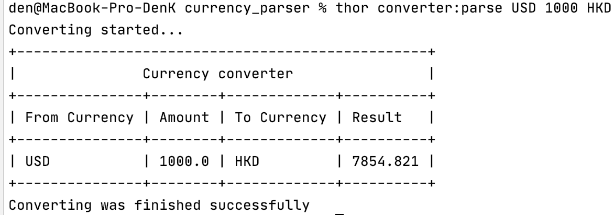

# Installation

- Install [RVM](https://rvm.io/) on you machine

`gpg2 --recv-keys 409B6B1796C275462A1703113804BB82D39DC0E3 7D2BAF1CF37B13E2069D6956105BD0E739499BDB`

`\curl -sSL https://get.rvm.io | bash -s stable`

- Install ruby 3.1.1 

`rvm install 1.1.1`

- Install bundler

`gem install bundler`

- Install dependencies

`bundle`

# Usage

Run in console `thor converter:parse USD 1000 HKD`

# Example

